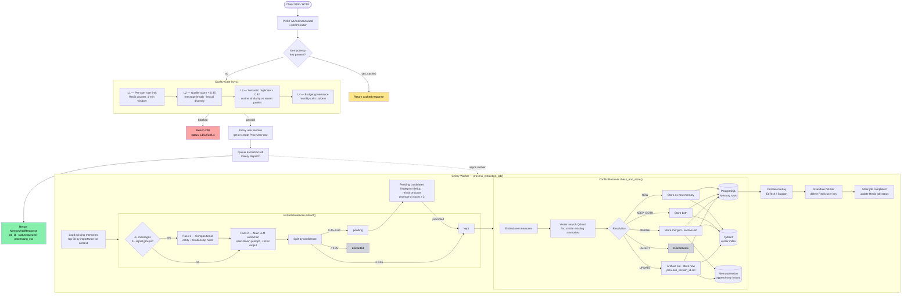
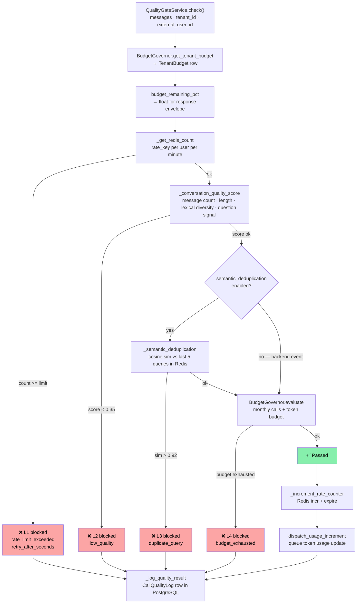
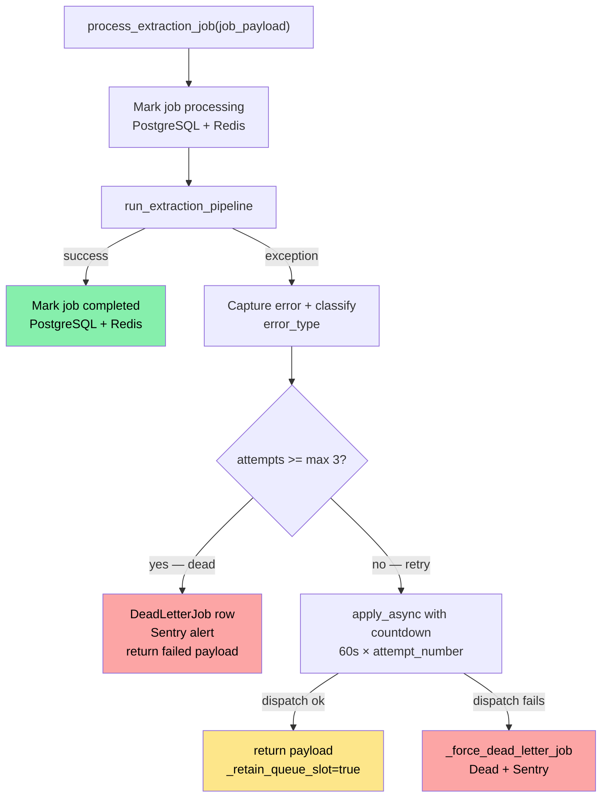
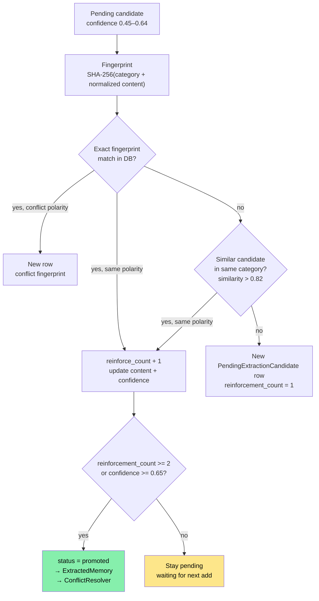
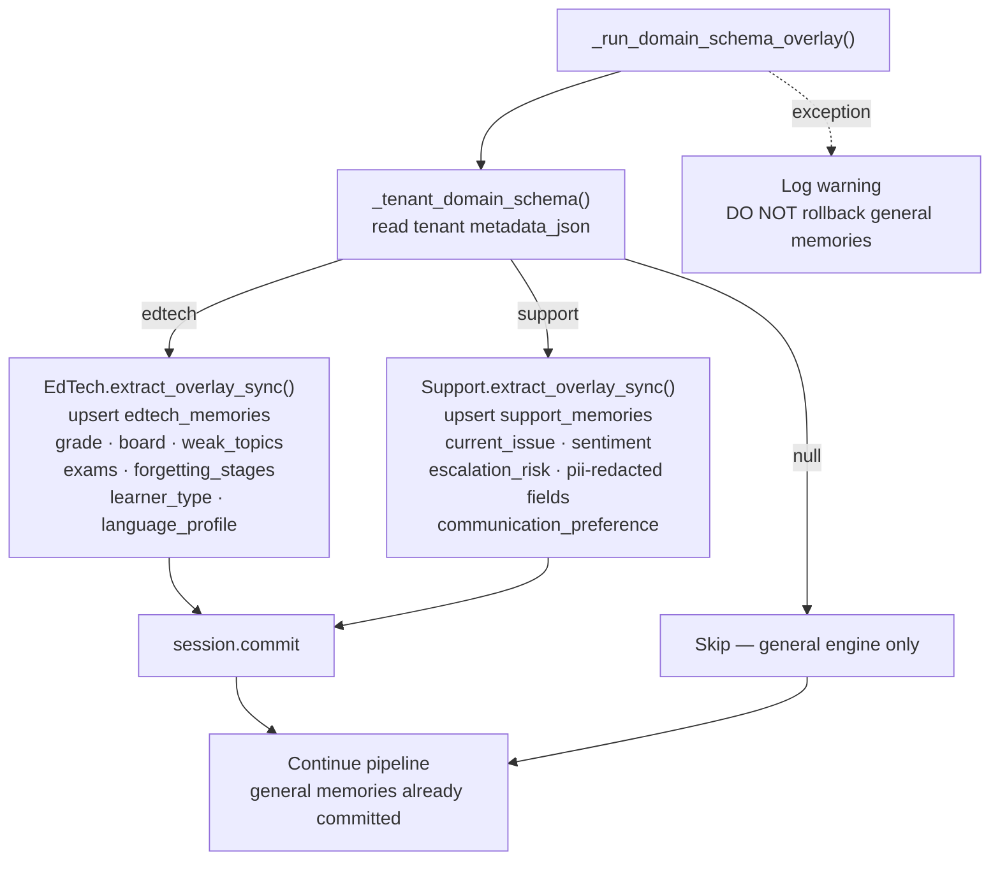
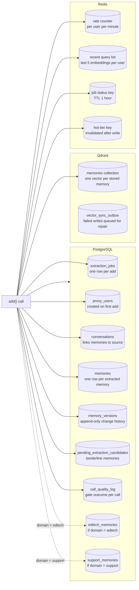
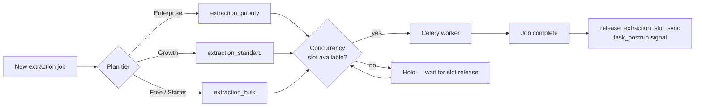
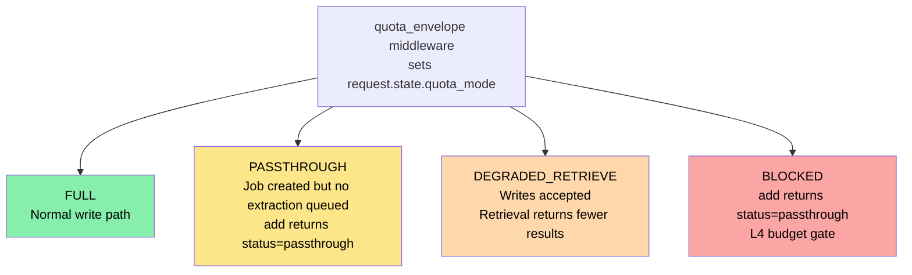

# Memory Writing Layer — System Design

> Generated from `memory-api` source. Covers the full path from an `add()` call to durable storage in PostgreSQL and Qdrant.

---

## 1. OverviewMermaid diagrams (the best option)

The memory write layer is a **queue-first async pipeline**. The HTTP request returns quickly with a `job_id`. All heavy work — extraction, conflict resolution, vector indexing, and domain overlays — runs in a Celery worker.



---

## 2. Entry Point — `POST /v1/memories/add`

**File:** `api/routers/memories.py`

### Step 1 — Idempotency check

If the request includes an `Idempotency-Key` header, the router checks Redis for a previously cached response for that `(tenant_id, idempotency_key)` pair. A cache hit replays the original response without re-running any logic.

### Step 2 — Quality Gate

`QualityGateService.check()` runs synchronously before any database write. Four sequential layers:

| Layer | Check | Block reason |
| --- | --- | --- |
| L1 | Per-user rate limit (Redis counter, 1-min window) | `rate_limit_exceeded` |
| L2 | Conversation quality score < `0.35` | `low_quality` |
| L3 | Semantic cosine similarity > `0.92` against recent queries | `duplicate_query` |
| L4 | Budget governance (monthly calls / tokens) | `budget_exhausted` |

A blocked request returns HTTP `200` with `status: "L1"` / `"L2"` / `"L3"` / `"L4"`. The LLM call is never blocked by a gate failure.

**Quality score formula** (L2):
```
score = (message_count_score × 0.25)
      + (avg_length_score   × 0.30)
      + (lexical_diversity  × 0.25)
      + (question_signal    × 0.20)
```

**Semantic deduplication** (L3):
- Embeds the incoming conversation text
- Compares cosine similarity against the last 5 query embeddings stored in Redis per user
- Conflicting salient entities (acronyms, numbers, subject-like tokens) bypass the similarity check — a new exam name or score is never treated as a duplicate

Registered backend events (`payload.source` present) skip L3 entirely — legitimate service events look similar by design.

### Step 3 — Proxy user resolve

`ProxyUserService.resolve()` maps `(tenant_id, external_user_id)` → a `ProxyUser` row in PostgreSQL. Creates the row on first encounter.

### Step 4 — Queue the job

`MemoryService.queue_memory_add()` creates an `ExtractionJob` row and dispatches `process_extraction_job` to Celery. The router reads the queue ETA from Redis to set `processing_eta_seconds` and the `X-MemoryOS-Processing` response header.

---

## 3. Quality Gate Detail

**File:** `api/services/quality_gate.py`



> Redis failures are caught and circuit-breaker-guarded. A Redis outage skips L1 and L3 rather than blocking the request.

---

## 4. Celery Pipeline — `process_extraction_job`

**File:** `api/tasks/extraction_tasks.py`

The task entry point is `process_extraction_job(job_payload)`. It calls `run_extraction_pipeline()` which does the real work.

### Retry logic



### Pipeline steps inside `run_extraction_pipeline()`

#### 4a. Load context

```python
existing_memories = _load_existing_memories_for_context(session, proxy_user_id)
# Top 50 non-archived memories ordered by importance_score DESC
# Passed to extractor so it avoids re-extracting what's already known
```

#### 4b. Source event context

If the job has a `source_event_id` and `source.explicit = True`, the pipeline builds a provenance snapshot to pass to the extractor, enabling "authenticated service event mode."

#### 4c. Extraction — `ExtractionService.extract_sync()`

**File:** `api/services/extraction_service.py`

Two-pass extraction for complex conversations:

**Pass 1 — Compositional pre-pass** (conditional):

Triggered when the conversation has ≥ 4 messages, ≥ 240 chars, ≥ 2 user turns, and ≥ 2 signal groups (identity, team, project, goal, preference, timeline). Makes a fast LLM call to find entities and cross-message relationships. Output is appended to the main extraction prompt as hints.

**Pass 2 — Main extraction**:

```
System prompt built from extraction_spec.md:
  - Category definitions
  - Importance rubric (1–10 scale)
  - Never-store rules
  - Confidence thresholds

LLM returns:
  {
    "memories": [
      { "content", "category", "importance_score", "confidence", "reasoning" }
    ],
    "nothing_to_extract": bool,
    "extraction_notes": string
  }
```

**Confidence thresholds:**

| Confidence | Outcome |
| --- | --- |
| ≥ 0.65 | `kept` — goes to conflict resolver immediately |
| 0.45–0.64 | `pending` — held in `PendingExtractionCandidate` table |
| < 0.45 | Discarded |

**Additional filters on each candidate:**
- `importance_score` must be ≥ 2.0
- Category must be in `{preference, fact, goal, procedure, relationship, expertise}`
- Content length: 10–500 chars
- Temporary session memory patterns are rejected (regex: "current debugging session", "next terminal command", etc.)

**Multi-provider fallback:**

`LLMService` tries providers in configured order (`LLM_PROVIDER_ORDER=gemini,openai,anthropic`). A circuit breaker per provider handles 5xx / timeout / rate-limit failures with automatic fallthrough.

#### 4d. Pending candidate management



#### 4e. Conflict resolution — `ConflictResolver.check_and_store()`

**File:** `api/services/conflict_resolver.py`

For each extracted memory:
1. Embed with `EmbeddingService`
2. Vector search in Qdrant for semantically similar existing memories
3. Classify the conflict
4. Apply resolution:

| Resolution | What happens |
| --- | --- |
| `UPDATE` | Old memory archived, new memory stored, `previous_version_id` set |
| `MERGE` | Combined memory stored, old archived |
| `KEEP_BOTH` | Both memories stored (different time context or both valid) |
| `REJECT` | New memory discarded (duplicate or lower quality) |
| `NEW` | No conflict found — memory stored as new |

Every change is recorded in `MemoryVersion` (append-only). Cross-user conflicts (shared facts) use recency and confidence weighting. Personal conflicts route to `ClarificationQueue` for the user to resolve at next session.

Domain-aware conflict routing:

- EdTech: personal student facts → `ClarificationQueue`; institutional facts → tenant dashboard review
- Support: similar routing for customer vs. workspace facts

#### 4f. Vector storage

Each stored memory gets an embedding written to Qdrant (`memories` collection). The embedding model and dimensions are configurable (`EMBEDDING_MODEL`, `EMBEDDING_DIMENSIONS`).

A `vector_sync_outbox` table catches any Qdrant write failures for async repair.

#### 4g. Domain schema overlay

Runs **after** general extraction and conflict resolution.



> Domain overlay failures are isolated — the general memories already committed are never rolled back.

#### 4h. Hot-tier cache invalidation

After commit, `_invalidate_proxy_user_cache(proxy_user_id)` deletes the Redis hot-memories key for the user (`user:{proxy_user_id}:hot_memories`). The next retrieval will rebuild from PostgreSQL + Qdrant.

#### 4i. Job status tracking

- PostgreSQL `ExtractionJob` row tracks `status`, `attempts`, `memories_created`, `completed_at`, `dead_lettered_at`
- Redis key `job:{job_id}:status` tracks live status for fast `GET /jobs/{job_id}` polling (TTL 1 hour)

---

## 5. Data Written per Successful `add()`



---

## 6. Queue Architecture

**File:** `api/tasks/queue_router.py`

Tenants are routed to different Celery queues based on plan tier:

| Plan | Queue |
| --- | --- |
| Enterprise | `extraction_priority` |
| Growth | `extraction_standard` |
| Free / Starter | `extraction_bulk` |



---

## 7. Degradation Modes



---

## 8. Key Files Reference

| File | Role |
| --- | --- |
| `api/routers/memories.py` | HTTP entry point, idempotency, gate call, job dispatch |
| `api/services/quality_gate.py` | L1–L4 gate, rate limiting, semantic dedup, quality scoring |
| `api/services/budget_governor.py` | Tenant budget evaluation and token usage tracking |
| `api/services/extraction_service.py` | Two-pass LLM extraction, spec-driven prompts, candidate filtering |
| `api/tasks/extraction_tasks.py` | Celery task, full pipeline orchestration, retry + dead-letter |
| `api/services/conflict_resolver.py` | Memory dedup, conflict classification, resolution routing |
| `api/services/version_service.py` | Append-only version history |
| `api/services/embedding_service.py` | Vector embedding (Gemini / fallback) |
| `api/db/vector_store.py` | Qdrant read/write |
| `api/services/domain_schemas/edtech.py` | EdTech overlay extraction |
| `api/services/domain_schemas/support.py` | Support overlay extraction |
| `api/tasks/queue_router.py` | Tenant queue routing + concurrency slot management |
| `api/middleware/quota_envelope.py` | Quota mode headers → `request.state` |
| `api/db/models.py` | All ORM models |
